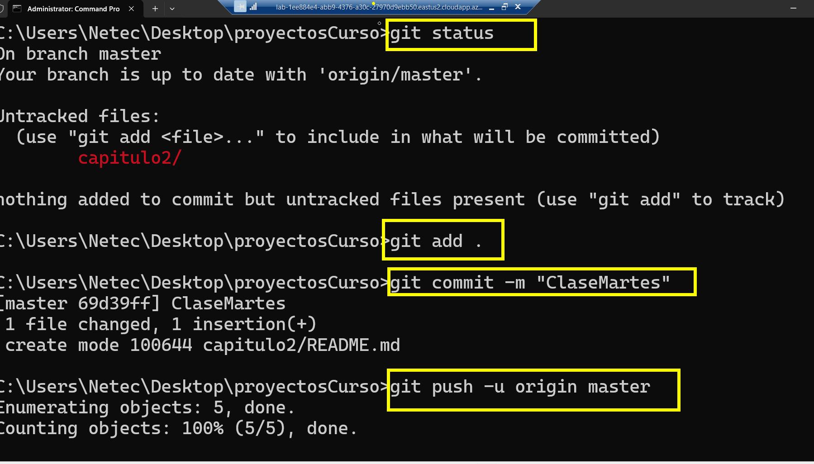

# Dentro de este repositorio se compartirá información de la clase

# Iniciar registro de Maquina Virtual

> Antes de comenzar el regiistro hay que tener una cuenta personal de microsoft

- Registro:           https://labs.azure.com/register/212ze1po4
- Iniciar sesión con **una cuenta persona de microsoft**

- Usuario:            Netec
- Contraseña:      Pa55w.rd

# Enlaces de interés
# Código HTTP
## [http codes](https://developer.mozilla.org/en-US/docs/Web/HTTP/Status)

# Comandos para subir al repo

